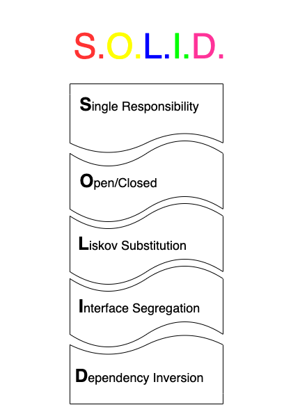

## solid-principles

### Single Responsibility Principle

Class should have only one responsibility which means class should be highly cohesive and implement strongly related logic. Class implementing feature 1 AND feature 2 AND feature 3 (and so on) violates SRP.

### Open/closed Principle

Class should be open for extension and closed for modification. You should be able to extend class’ behavior without the need to modify its implementation (how? Don’t modify existing code of class X but write a new piece of code that will be used by class X).

### Liskov Substitution Principle

Extension of open/closed principle stating that new derived classes extending the base class should not change the behavior of the base class (behavior of inherited methods). Provided that if a class Y is a subclass of class X any instance referencing class X should be able to reference class Y as well (derived types must be completely substitutable for their base types).

### Interface Segregation Principle

Client should not depend on interface/methods which it is not using.

### Dependency Inversion Principle

High-level modules (e.g. business logic) should not depend on low-level modules (e.g. database operations or I/O). Both should depend on abstractions. Abstractions should not depend on de- tails. Details should depend on abstractions.
